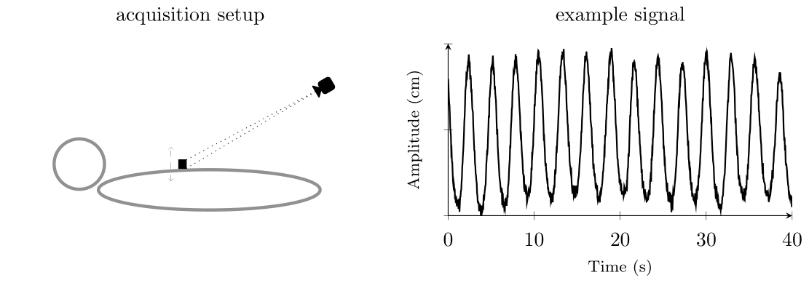

# Respiratory signal database
This SQLite-driven database contains  2510 respiratory signals (uni-variate time series)  of 419 patients  (total acquisition time > 325.000 s).
We hope that this data will be widely used for respiratory motion prediction as well as uni-variate time series forecasting in general. 
To this end, we provide data splitting (train, val and test set), preprocessing functionality and a pytorch dataset/loader template, which may be helpful in your machine or deep learning project.

We advise to use https://sqlitebrowser.org/ as additional database browsing tool.
Currently, only python is supported. However, we hope that we can provide a Rest-API in the near future (approx. September 2023) for non-python user.
If you experience any troubles, feel free to open an issue.


Author: Lukas Wimmert ([l.wimmert@uke.de](mailto:author_email))


## Installation
Download sql database from our owncloud server (https://icns-nas1.uke.uni-hamburg.de/owncloud10/index.php/s/O1jBYsXEqYIXiwm)

Clone this repository to your local machine:
```bash
git clone https://github.com/IPMI-ICNS-UKE/RPM_DB.git
```

cd into the repo and install necessary dependencies and the package itself:
```bash
pip install -r requirements.txt
pip install -e .
```
Tested with Python 3.9.11.

## Usage
Always start by connecting to the database:

```python
from pathlib import Path
from resp_db.client import RpmDatabaseClient

db_root = Path("example_database_path.db")  # change to the downloaded db-file
client = RpmDatabaseClient(db_filepath=db_root)
```

### query and preprocess a specific signal
```python
# query a signal
with client:
    df_signal, signal = client.get_specific_signal(
        research_number=5708019,
        modality="4DCT", # or "CBCT" or "LINAC"
        fraction= 0, # "4DCT" = 0, "LINAC" fractions between 1 and 5
        origin="UKE")

# preprocess 
sampling_rate = 25 # sampling rate in HZ, i.e. points per second.
df = RpmDatabaseClient.preprocess_signal(  
    df_signal=df_signal,
    sampling_rate=sampling_rate,
    only_beam_on=True,  # strongly recommended
    remove_offset=True, # strongly recommended
)
# df.columns = [time, amplitude]
```

### query all signals of train(/val/test) set
```python
with client:
    query = client.get_signals_of_dl_dataset(
        dl_dataset="train", project="short-term-prediction"
    )
query = list(query)  # query contains all train signals
# preprocess all signals 
query = [RpmDatabaseClient.preprocess_signal(df_signal=signal.df_signal,
                                             sampling_rate=25,
                                             only_beam_on=True,  # strongly recommended
                                             remove_offset=True  # strongly recommended
                                             )
         for signal in query]
# query is a list of dataframes. 

```
Feel free to write more query functions and add them to the RpmDatabaseClient. 
###  data-set/loader template
Have a look at our pytorch template at "scripts/dataloader.py" for machine/deep learning projects.

## Further information
### respiratory signal acquisition details
All respiratory signals were recorded during radiotherapy treatment (i.e. 4D CT, 4D CBCT and dose delivery) of patients with thoracic lesions between February 2013 and May 2022 at the clinic of _Radiotherapy and Radiation Oncology_ of the _University Medical Center Hamburg-Eppendorf_.
Data acquisition was performed using the _Varian RPM System_, i.e. monitoring an external marker block placed on the patient's chest wall with an infrared camera system (uni-variate time series).
All patients did not receive any visual guidance or coaching and, therefore, can be considered as free-breathing patients. 



### data(set) overview
Data splitting was performed on patient level. Thus, all signals of one patient belong to one set.

| Signal overview |   modality    | # signals | # patients | mean signal length (s) | Data splitting  | set        | data  | # signals |
|:---------------:|:-------------:|-----------|------------|------------------------|-----------------|------------|-------|-----------|
|                 |     4DCT      | 481       | 419        | 98.1                   |                 | training   | 50 %  | 1265      |
|                 |    4D CBCT    | 251       | 52         | 59.6                   |                 | validation | 20 %  | 516       |
|                 | dose delivery | 1778      | 357        | 145.6                  |                 | testing    | 30 %  | 726       |
|                 |      sum      | 2510      |            | 129.3                  |                 |            |       |           |


Lastly, open access of retrospectively collected and anonymized respiratory signals was approved by the local ethics board and the need to obtain written informed consent was waived [2023-300334-WF].

###

## License
[MIT](https://choosealicense.com/licenses/mit/)